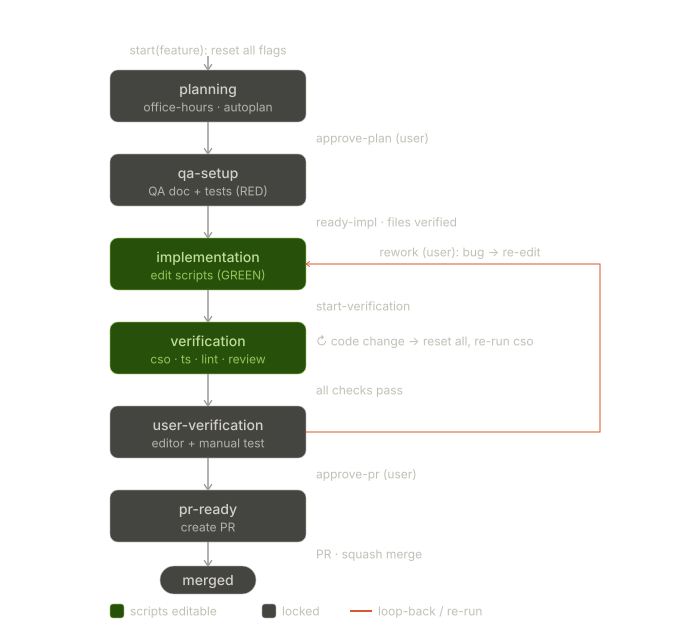

# ADR 004: 워크플로우 상태 머신 (phase 단일 진실 + CLI 단일 작성자)

- **날짜:** 2026-05-29
- **상태:** 결정됨

## 컨텍스트

기능 개발 워크플로우(CLAUDE.md § Workflow)는 `.claude/workflow-state.json`의 boolean 플래그 묶음(`plan_approved`, `qa_doc_ready`, `cso_done`, `ts_check_clean`, `lint_clean`, `code_review_clean`, `pr_approved`)으로 진행 단계를 표현하고, PreToolUse 훅(`gate-implementation.sh`)이 그 플래그를 읽어 `game/assets/scripts/**/*.ts` 편집을 게이팅했다. 이 구조에 다음 문제가 있었다.

1. **사용자 검증(7단계)발 복귀 루프가 없음.** 6단계가 끝나면 네 검증 플래그가 모두 true가 되어 훅의 "검증 완료 = 잠금" 블록이 발동, 스크립트 편집이 막힌다. 그 상태로 진입하는 수동 인게임 테스트는 버그가 가장 많이 나오는 단계인데, "버그 발견 → 구현 복귀" 전이가 플로우에 정의돼 있지 않았다. 잠금 메시지가 "플래그를 false로 초기화하라"고 안내했지만 그건 사람이 JSON을 손으로 고치라는, 플로우 바깥의 우회였다.
2. **재실행 루프 간 리셋 비대칭.** cso 이슈 루프는 4개 플래그를 모두 리셋했지만, 코드리뷰 수정 루프는 `cso_done`을 true로 둔 채 3개만 리셋했다. 리뷰 단계에서 로직을 고쳐 보안에 영향을 줘도 `/cso`가 다시 돌지 않았다.
3. **플래그가 AI 자가 기록 + JSON 직접 편집 가능.** 모든 전이를 AI가 JSON을 직접 써서 기록했고, 훅이 `.claude/` 쓰기를 허용해 AI가 플래그를 손으로 켜서 게이트를 우회할 수 있었다.
4. **리셋(0단계)이 기억 의존.** 새 기능 시작 시 플래그 초기화를 "AI가 0단계를 기억해 실행"하는 구조라, 빠뜨리면 이전 기능의 all-clean 잠금 상태가 새 기능으로 새어 들어왔다.
5. **feature 슬러그 케이싱 드리프트.** 문서는 `docs/qa/[feature]-test.md`(kebab), 테스트는 `tests/logic/[Feature].test.ts`(Pascal)로 케이싱이 갈려 같은 기능을 가리키는 식별자가 두 규칙을 오갔다.
6. **훅 출력 스키마 비표준.** `gate-implementation.sh`는 `{"permissionDecision":...}`를 출력했으나, 공식 스키마는 `hookSpecificOutput.permissionDecision`이라 실제로 deny가 발동하지 않을 위험이 있었다.

## 결정

**phase를 단일 진실로 삼고, 상태 변경의 단일 작성자를 `.claude/workflow.mjs` CLI로 둔다. PreToolUse 훅(`gate-scripts.mjs`)은 (1) 상태 파일 직접 편집을 차단하고 (2) phase 기준으로 스크립트 편집을 게이팅한다.**

게이트는 더 이상 플래그 묶음이 아니라 **phase 하나**로 판단한다. 검증 하위 플래그(`cso_done` 등)는 `verification` phase 안에서 4개 체크가 모두 통과했는지 판정하는 용도로만 쓰이고, 전부 통과하면 자동으로 다음 phase로 넘어간다.

### 상태 머신



```
planning → qa-setup → implementation → verification → user-verification → pr-ready → done
```

- **스크립트 편집 허용 phase:** `implementation`, `verification` (그 외 phase에서는 `game/assets/scripts/**/*.ts` 편집을 훅이 deny)
- **RED 게이트 (`ready-impl`):** 스킵이 아니면 피처 테스트(`tests/logic/[Feature].test.ts`)를 `vitest run`으로 실제 실행해 **실패(RED)할 때만** `implementation`으로 전환한다. 테스트가 통과해 버리면(= TDD 시작점이 아님) 전환을 차단한다. (한계 #2의 RED 부분 해소)
- **GREEN 게이트 (`start-verification`):** 전체 스위트를 `vitest run`으로 실행해 **전부 통과(GREEN)할 때만** `verification`으로 전환한다. 실패가 있으면 차단하고 `implementation`에 머문다. (한계 #2의 GREEN 부분 해소 — 기존 "AI가 수동으로 `pnpm test` 실행" honor-step을 대체)
- **rework (coral):** `user-verification`에서 수동 테스트 중 버그 발견 → `implementation`으로 복귀하며 검증 플래그 초기화, 편집 재허용. (문제 1 해결 — 비어 있던 복귀 루프를 닫음)
- **invalidate:** `verification` 중 프로덕션 코드를 고치면(코드리뷰발 포함) `cso_done`을 포함한 네 검증 플래그를 **전부** 초기화하고 cso부터 다시 돈다. (문제 2 해결 — 리셋 비대칭 제거)

### 명령어 (상태 전이)

| 명령 | 주체 | 전이 |
|------|------|------|
| `start <feature>` | AI | 전체 초기화 → `planning` (문제 4 해결 — 리셋을 결정적 트리거에 묶음) |
| `approve-plan` | 사용자 트리거(`계획 승인`)→AI | `planning` → `qa-setup` |
| `skip-test "<사유>"` | AI | 순수 로직 없을 때 테스트 스킵 (사유 필수) |
| `ready-impl` | AI | `qa-setup` → `implementation`. **디스크에서** QA 문서·테스트 파일 존재를 확인하고, 스킵이 아니면 피처 테스트를 실제로 돌려 **RED(실패)인지** 검증 (통과하면 차단) |
| `start-verification` | AI | `implementation` → `verification`. 전환 전 전체 스위트(`vitest run`)를 돌려 **GREEN(통과)인지** 검증 (실패하면 차단) |
| `pass <cso\|ts\|lint\|review>` | AI | 개별 검증 통과 표시. 4개 모두 통과 시 자동으로 `user-verification`(편집 잠금) |
| `invalidate` | AI | `verification` 중 코드 변경 → 전체 검증 초기화 |
| `rework` | 사용자 트리거(`리워크`)→AI | `user-verification` → `implementation` (버그 발견 시 복귀) |
| `approve-pr` | 사용자 트리거(`PR 승인`)→AI | `user-verification` → `pr-ready` |
| `pr-done` | AI | `pr-ready` → `done` |
| `status` | — | 현재 상태 + 편집 가능 여부 출력 |

상태 변경은 전부 CLI로만 한다. 짧게 쓰도록 `package.json`에 `wf` 스크립트를 두어 **`pnpm wf <command>`**로 호출한다(= `node .claude/workflow.mjs <command>`). 훅이 `workflow-state.json` 직접 편집을 차단하므로 AI가 JSON을 손으로 고쳐 우회하는 길이 끊긴다. (문제 3 일부 해결)

사람 게이트(`approve-plan`·`approve-pr`·`rework`)는 사용자가 매번 풀 커맨드를 치는 부담을 줄이기 위해, **사용자가 자연어(`계획 승인`·`PR 승인`·`리워크`)로 지시하면 AI가 해당 `pnpm wf` 커맨드를 대신 실행**하는 방식으로 운영한다. 나머지 기계적 전이는 AI가 절차에 따라 자동 실행한다.

## 배치

| 파일 | 역할 |
|------|------|
| `.claude/workflow.mjs` | 상태 단일 작성자 CLI |
| `.claude/hooks/gate-scripts.mjs` | PreToolUse 훅 (matcher `Write\|Edit\|MultiEdit`) |
| `.claude/settings.json` | 위 훅을 `node $CLAUDE_PROJECT_DIR/.claude/hooks/gate-scripts.mjs`로 등록 |
| `.claude/workflow-state.json` | phase 단일 진실 상태 (CLI로만 기록) |

훅 출력은 공식 스키마 `hookSpecificOutput.permissionDecision`을 사용한다. (문제 6 해결) `ready-impl`의 파일 존재 검사와 `tests/logic/[Feature].test.ts` 경로 생성은 CLI 안에서 kebab→Pascal 변환(`toPascal`)으로 일원화해 케이싱 드리프트를 제거했다. (문제 5 해결)

## 한계 (honor-system이 남는 지점)

정직하게 짚어둔다. 이 구조는 **우발적·위조성 플래그 조작을 막는 강도**까지 올린 것이지 "AI가 절대 못 푸는 잠금"은 아니다.

- **사람 게이트는 AI가 실행하므로 honor-system에 의존한다.** 사용성을 위해 `approve-plan`·`approve-pr`·`rework`를 "사용자 자연어 지시 → AI 실행"으로 두기로 했다(아래 결정 참고). 따라서 보호 근거는 "사용자가 셸에서 직접 커맨드를 친다"가 아니라 **"사용자가 대화에서 실제로 승인 문구를 입력했다"**는 점이다. AI가 승인 없이 임의로 전이하지 않을 것이라는 신뢰가 전제다. 막아주는 건 (1) JSON 직접 편집 차단, (2) `ready-impl`의 디스크 사실 검증, (3) 모든 전이의 phase 순서 검증뿐이며, 이는 우발적·위조성 조작을 막을 뿐 악의적 AI를 막지는 못한다. 더 강한 보장이 필요하면 사용자만 생성 가능한 토큰 파일을 승인 커맨드의 전제로 요구하는 방식으로 보강할 수 있다.
- **테스트 게이트는 더 이상 명목상이 아니다 (한계 #2 해소).** 초안에서는 `ready-impl`이 QA 문서·테스트 파일의 *존재*만 확인할 뿐 테스트가 RED인지·`pnpm test`가 통과하는지는 검증하지 않아, TDD가 흐름상 강제가 아니라 명목상이었다. 이제 `ready-impl`은 피처 테스트를 실제로 돌려 **RED일 때만** 통과시키고, `start-verification`은 전체 스위트가 **GREEN일 때만** 검증에 진입시킨다(둘 다 `vitest run` 실행, 비정상 종료 시 차단).
  - **남는 honor-system:** RED 검사는 *모든* 비정상 종료(non-zero)를 RED로 받아들인다. 따라서 테스트 파일의 문법/임포트 오류도 "RED"로 읽힌다 — "잘 만들어진 실패 단언"이 아니라 "실패하는 피처 테스트가 존재함"을 강제할 뿐이다. 또한 게이트는 `verification` 진입 시점에만 GREEN을 강제하므로, 검증 중 코드를 고쳐 `invalidate`로 cso/ts/lint/review를 다시 도는 경우 테스트 재실행은 절차(신뢰)에 맡긴다.
  - **게이트가 막는 편집 범위는 여전히 `game/assets/scripts/**/*.ts` 한 디렉터리뿐이다.** 그 밖의 내용 검증(보안·타입·린트·리뷰)은 honor-system이다.

## 참고

- [ADR 002: scripts/logic/ 분리 패턴](./002-scripts-logic-pattern.md)
- [ADR 003: 테스트 전략](./003-testing-strategy.md)
- CLAUDE.md § Workflow — 기능 개발 절차 (이 ADR의 명령어를 단계별로 사용)
