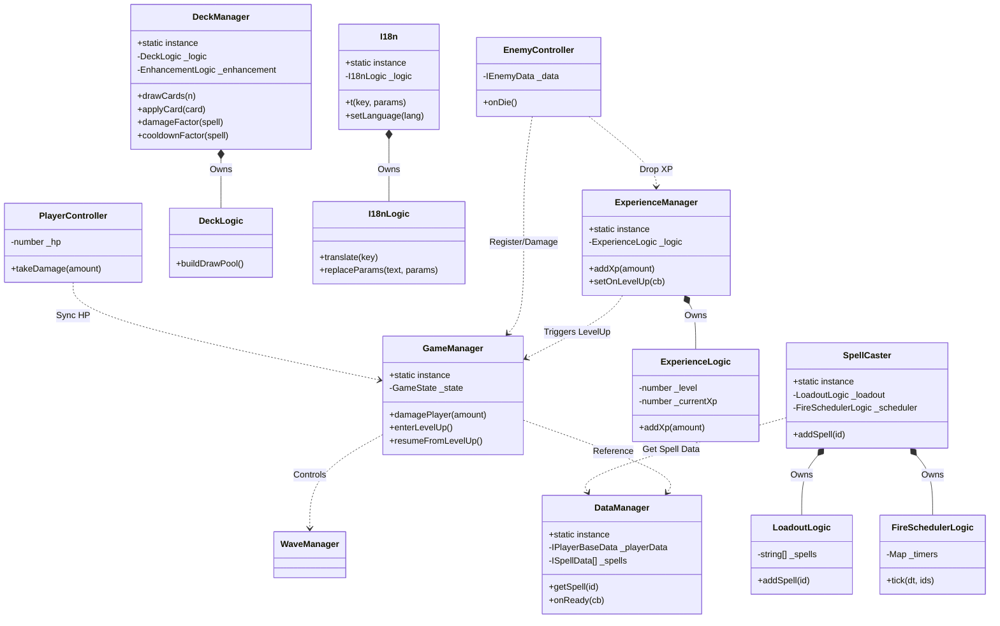

# 게임 아키텍처 및 클래스 구조 문서 (Architecture & Structure)

> **최초 작성:** 2026-06-02 · **마지막 갱신:** 2026-06-04
> **대상:** 사람(전체 구조 조감용). 별도 도구로 비정기 갱신하며 **AI 작업의 참조원이 아니다.**
> **코드와 어긋나면 코드가 정본이다.** 갱신 주기가 슬라이스보다 느려 뒤처져 있을 수 있다 — 2026-07-25 기준 `logic/` 31개 중 6개만 반영돼 있다. 구현 동작을 알아야 하면 해당 소스와 JSDoc을 본다.
> **관련 문서:** [코드 컨벤션](conventions.md)

이 문서는 `monster` 프로젝트의 TypeScript 클래스 기반 아키텍처와 디렉토리 구조, 그리고 핵심 시스템 간의 상호작용을 정의합니다.

---

## 1. 아키텍처 핵심 원칙

본 프로젝트는 Cocos Creator 환경에서 **유지보수성**과 **테스트 용이성**을 확보하기 위해 다음과 같은 원칙을 따릅니다.

1. **순수 로직 분리 (Logic Separation):** 복잡한 게임 규칙(경험치 계산, 마법 쿨다운, 덱 합성 등)은 Cocos 엔진(`cc`)과 분리된 순수 TypeScript 클래스로 작성하여 Vitest를 통해 단위 테스트를 수행합니다.
2. **데이터 주도 설계 (Data-Driven Design):** 마법, 적, 플레이어 수치, 카드 등 모든 콘텐츠 속성은 JSON 데이터로 정의하며 코드는 이를 해석하는 역할만 수행합니다.
3. **단방향 의존성 및 싱글톤 매니저:** 글로벌 상태는 `systems/`의 싱글톤 매니저가 관리하며, `components/`는 매니저를 참조하여 동작합니다.
4. **표시 텍스트 분리 (i18n-first):** 순수 로직에는 사용자에게 보여지는 텍스트를 포함하지 않으며, 텍스트 키(`key`)와 파라미터만 UI로 전달하여 UI 계층에서 다국어 처리(`t()`)를 수행합니다.

---

## 2. 디렉토리 구조 및 역할 (`assets/scripts/`)

### `logic/` (순수 비즈니스 로직)
- **역할:** Cocos Creator(`cc`)에 의존하지 않는 순수 TypeScript 클래스 모음입니다.
- **특징:** 파일 기반 단위 테스트(Vitest)의 핵심 대상입니다. 상태를 변환하거나 계산 결과를 반환합니다.
- **주요 클래스:**
  - `LoadoutLogic`: 플레이어가 보유한 마법 슬롯 관리.
  - `FireSchedulerLogic`: 마법별 독립 쿨다운 스케줄링.
  - `ExperienceLogic`: 경험치 누적 및 레벨업 판정 계산.
  - `DeckLogic`: 정적 카드와 동적 카드(미보유 마법)를 합성하여 드로우 풀 생성.
  - `I18nLogic`: 다국어 키 매칭 및 파라미터 치환 로직.

### `components/` (Cocos 노드 컴포넌트)
- **역할:** 씬(Scene) 내의 Node에 직접 부착되는 `Component` 클래스입니다.
- **특징:** `logic/`의 순수 클래스를 인스턴스화하여 감싸며(Wrapper), Cocos의 라이프사이클(`update`, `onLoad`)과 충돌, 물리 위치 처리 등을 담당합니다.
- **주요 클래스:**
  - `PlayerController`: 플레이어 이동, 입력, HP 게이팅 및 피격 처리.
  - `SpellCaster`: `PlayerController`와 분리되어 마법 발사 책임을 전담. (`LoadoutLogic` + `FireSchedulerLogic` 조합)
  - `EnemyController`: 적의 이동 및 충돌, 사망 시 처리.
  - `XPItemController`: 경험치 아이템 드롭 및 플레이어 흡수 처리.
  - `Projectile`: 마법 발사체 이동 로직.

### `systems/` (글로벌 매니저)
- **역할:** 게임 전반의 상태를 관리하는 싱글톤(`static instance`) 클래스들입니다.
- **특징:** 다른 컴포넌트들이 쉽게 접근할 수 있도록 전역 진입점을 제공합니다.
- **주요 클래스:**
  - `GameManager`: 게임 상태(`Playing`, `LevelUp`, `GameOver`, `Victory`), 타이머, 플레이어 HP 관리.
  - `DataManager`: `resources/data/*.json` 로드 및 파싱 (데이터 주도 설계의 코어).
  - `DeckManager`: 카드 드로우, 사용자 선택 카드 효과(강화/최대 체력 증가 등) 전역 적용.
  - `WaveManager`: 웨이브 타이머 및 웨이브별 몬스터 스폰 관리.
  - `ExperienceManager`: `ExperienceLogic`을 래핑하여 레벨업 이벤트를 `GameManager`에 전달.
  - `I18n`: 다국어 JSON 로드 및 라벨 등록/갱신 관리.

### `data/` (타입 및 인터페이스)
- **역할:** 프로젝트 전반에서 사용되는 타입 선언 파일.
- **주요 클래스:**
  - `GameTypes.ts`: `GameState`, `ISpellData`, `IEnemyData`, `ICardData` 등의 인터페이스 및 Enum 집합.

### `ui/` (사용자 인터페이스)
- **역할:** 화면 렌더링 노드(HUD, 패널 등)를 제어하는 컴포넌트입니다.
- **주요 클래스:**
  - `HudController`: 체력바, 타이머, 웨이브, 경험치 등 상단 UI 갱신.
  - `CardSelectPanel`: 레벨업 시 나타나는 카드 선택 화면 표시 및 사용자 입력(`DeckManager`로 전달).
  - `LocalizedLabel`: 다국어 키를 기반으로 텍스트를 자동 번역해주는 UI 컴포넌트.

---

## 3. 핵심 시스템 상호작용 (Flow)

### 3.1. 마법 장착 및 발사 플로우 (Magic & Combat)
1. `SpellCaster` 컴포넌트가 `update()`마다 `FireSchedulerLogic`의 `tick`을 호출하여 마법 쿨다운을 갱신합니다.
2. 쿨다운이 완료된 마법이 있다면, 주변의 적을 탐색(`_findNearestEnemy`)합니다.
3. 적이 존재하면 해당 마법 데이터(`DataManager`에서 조회)를 기반으로 `Projectile`을 생성 및 발사합니다.
4. 발사 후 `FireSchedulerLogic`의 `consume`을 호출하여 쿨다운을 초기화합니다.

### 3.2. 경험치 획득 및 레벨업 플로우 (XP & Level Up)
1. 적이 사망(`EnemyController`)하면 `XPItem` 프리팹이 드롭됩니다.
2. 플레이어가 `XPItemController`의 픽업 반경에 들어가면 아이템이 흡수되고 `ExperienceManager.addXp()`가 호출됩니다.
3. `ExperienceLogic`에서 요구 경험치 도달 여부를 판단하고, 레벨업 시 `ExperienceManager`가 이벤트를 발생시킵니다.
4. `GameManager`가 이를 감지하고 게임 상태를 `LevelUp`으로 변경하여 일시정지시킵니다.

### 3.3. 덱 시스템 및 카드 선택 플로우 (Deck & Cards)
1. 게임 상태가 `LevelUp`으로 변경되면 `HudController`가 `CardSelectPanel`을 활성화합니다.
2. 패널은 `DeckManager.drawCards()`를 호출하며, 내부에선 `DeckLogic.buildDrawPool()`을 통해 기본 카드와 미보유 마법(동적 합성 카드)을 혼합하여 풀을 구성합니다.
3. 사용자가 카드를 선택하면:
   - 마법 추가 카드(`type === 'magic'`): `SpellCaster.instance.addSpell()`을 호출하여 새 마법을 로드아웃에 등록합니다.
   - 강화 카드(`type === 'upgrade'`): `DeckManager.applyCard()`가 `EnhancementLogic.raise()`로 라우팅하여 per-spell(개별)·분류 트랙의 옵션 레벨을 +1 올립니다.
   - 전역 강화 카드(`type === 'enhancement'`, damage_boost/cooldown_reduce): `EnhancementLogic.addGlobal()`로 전역(플레이어) 보너스를 누적합니다(위계상 개별·분류보다 작음).
   - 플레이어 패시브 카드(`type === 'passive'`): `DeckLogic`에 누적합니다(현재 maxHpBonus).
   - 데미지·쿨다운은 발사 시 `DeckManager.damageFactor(spell)`/`cooldownFactor(spell)` = 개별×분류×전역 3-tier 곱으로 마법별 적용됩니다(기획 § 7.3).
4. `GameManager.resumeFromLevelUp()`이 호출되어 게임이 재개됩니다.

### 3.4. 다국어 처리 플로우 (i18n)
1. 순수 로직(`DeckLogic` 등)은 카드를 생성할 때 사용자에게 보여줄 문자열 대신 **다국어 키와 파라미터(`descKey`, `descParams`)**만 반환합니다.
2. UI 계층(`CardSelectPanel` 등)에서 해당 키를 받아 `I18n.instance.t()`를 통해 실제 표시 언어(ko/en)로 치환합니다.
3. 씬에 정적으로 배치되는 텍스트는 `LocalizedLabel` 컴포넌트를 부착해 활성화 시점에 자동으로 번역되도록 구성합니다.

---

## 4. 클래스 다이어그램 (Mermaid)

이 프로젝트의 핵심 시스템 간 관계를 시각화한 다이어그램입니다. [Mermaid Live Editor](https://mermaid.live/) 등을 통해 이미지로 렌더링할 수 있습니다.

