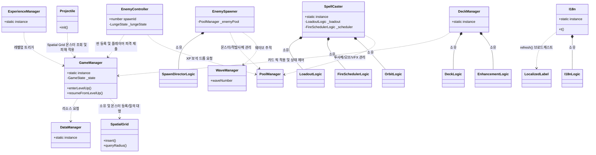

# 🏠 게임 아키텍처 및 클래스 구조 문서 (Architecture & Structure)

이 문서는 `monster` 프로젝트의 TypeScript 클래스 기반 아키텍처와 디렉토리 구조, 그리고 핵심 시스템 간의 상호작용을 정의하며 상세 서브시스템 분석 문서의 입구 역할을 수행합니다.

---

## 1. 아키텍처 핵심 설계 철학

본 프로젝트는 Cocos Creator 환경에서 **유지보수성**과 **테스트 용이성**을 확보하기 위해 다음과 같은 원칙을 따릅니다.

1.  **순수 로직 분리 (Logic Separation):** 복잡한 게임 규칙(경험치 계산, 마법 쿨다운, 덱 합성 등)은 Cocos 엔진(`cc`)과 분리된 순수 TypeScript 클래스([logic/](file:///F:/work/monster/game/assets/scripts/logic/))로 작성하여 Vitest를 통해 단위 테스트를 수행합니다. ([002-scripts-logic-pattern.md](file:///F:/work/monster/docs/decisions/002-scripts-logic-pattern.md) 의결 기준)
2.  **데이터 주도 설계 (Data-Driven Design):** 마법, 적, 플레이어 수치, 카드 등 모든 콘텐츠 속성은 JSON 데이터로 정의하며 코드는 이를 해석하는 역할만 수행합니다.
3.  **단방향 의존성 및 싱글톤 매니저:** 글로벌 상태는 [systems/](file:///F:/work/monster/game/assets/scripts/systems/)의 싱글톤 매니저가 관리하며, `components/`는 매니저를 참조하여 동작합니다.
4.  **표시 텍스트 분리 (i18n-first):** 순수 로직에는 사용자에게 보여지는 텍스트를 포함하지 않으며, 텍스트 키(`key`)와 파라미터만 UI로 전달하여 UI 계층에서 다국어 처리(`t()`)를 수행합니다.

---

## 2. 📂 디렉토리 구조 및 역할 (`assets/scripts/`)

### 2.1. [logic/](file:///F:/work/monster/game/assets/scripts/logic/) (순수 비즈니스 로직)
*   **역할:** Cocos Creator(`cc`)에 의존하지 않는 순수 TypeScript 클래스 모음입니다. 파일 기반 단위 테스트(Vitest)의 핵심 대상입니다.
*   **주요 클래스:**
    *   [LoadoutLogic.ts](file:///F:/work/monster/game/assets/scripts/logic/LoadoutLogic.ts): 플레이어가 보유한 마법 슬롯 관리.
    *   [FireSchedulerLogic.ts](file:///F:/work/monster/game/assets/scripts/logic/FireSchedulerLogic.ts): 마법별 독립 쿨다운 스케줄링.
    *   [ExperienceLogic.ts](file:///F:/work/monster/game/assets/scripts/logic/ExperienceLogic.ts): 경험치 누적 및 레벨업 판정 계산.
    *   [DeckLogic.ts](file:///F:/work/monster/game/assets/scripts/logic/DeckLogic.ts): 기본 카드와 미보유 마법을 합성하여 드로우 풀 생성.
    *   [EnhancementLogic.ts](file:///F:/work/monster/game/assets/scripts/logic/EnhancementLogic.ts): 3-Tier(개별/분류/전역) 마법 강화 배율 계산.
    *   [SpatialGrid.ts](file:///F:/work/monster/game/assets/scripts/logic/SpatialGrid.ts): 대규모 몬스터 충돌 감지 가속용 2D 공간 분할 그리드.
    *   [ObjectPoolLogic.ts](file:///F:/work/monster/game/assets/scripts/logic/ObjectPoolLogic.ts): 가비지 프리(Garbage-free) 객체 재사용 회계 관리.
    *   [StatusEffectLogic.ts](file:///F:/work/monster/game/assets/scripts/logic/StatusEffectLogic.ts): 정지/슬로우/빙결 디버프 수치 및 적용 판정.
    *   [I18nLogic.ts](file:///F:/work/monster/game/assets/scripts/logic/I18nLogic.ts) & [I18nKeyGuard.ts](file:///F:/work/monster/game/assets/scripts/logic/I18nKeyGuard.ts): 다국어 토큰 치환 및 카탈로그 번역 정합성 가드.
    *   [MovementLogic.ts](file:///F:/work/monster/game/assets/scripts/logic/MovementLogic.ts) & [EnemyAttackLogic.ts](file:///F:/work/monster/game/assets/scripts/logic/EnemyAttackLogic.ts): 몬스터 행동 FSM(지그재그, 돌진, 휘두르기).

### 2.2. [components/](file:///F:/work/monster/game/assets/scripts/components/) (Cocos 노드 컴포넌트)
*   **역할:** 씬(Scene) 내의 Node에 직접 부착되는 `Component` 클래스로, 순수 로직을 인스턴스화하여 감쌉니다.
*   **주요 클래스:**
    *   [PlayerController.ts](file:///F:/work/monster/game/assets/scripts/components/PlayerController.ts): 플레이어 이동, HP 및 무적시간 처리.
    *   [SpellCaster.ts](file:///F:/work/monster/game/assets/scripts/components/SpellCaster.ts): 마법 쿨다운을 틱하고 투사체 생성 및 발사를 전담.
    *   [EnemyController.ts](file:///F:/work/monster/game/assets/scripts/components/EnemyController.ts): 몬스터 FSM 갱신, 피격 연출, 접촉 피해 및 사망 처리.
    *   [Projectile.ts](file:///F:/work/monster/game/assets/scripts/components/Projectile.ts): 플레이어 투사체 직선/폭발 이동 및 명중 충돌 감지.
    *   [PoolManager.ts](file:///F:/work/monster/game/assets/scripts/components/PoolManager.ts): 노드 생성/비활성화/파괴를 래핑한 풀 연동 컴포넌트.

### 2.3. [systems/](file:///F:/work/monster/game/assets/scripts/systems/) (글로벌 매니저)
*   **역할:** 게임 전반의 상태를 관리하는 싱글톤(`static instance`) 클래스들입니다.
*   **주요 클래스:**
    *   [GameManager.ts](file:///F:/work/monster/game/assets/scripts/systems/GameManager.ts): 게임 플레이 상태 기계, 몬스터 등록 및 2D 격자 질의 중재.
    *   [DataManager.ts](file:///F:/work/monster/game/assets/scripts/systems/DataManager.ts): 외부 JSON 리소스 파일 로드 및 데이터 무결성 검증.
    *   [DeckManager.ts](file:///F:/work/monster/game/assets/scripts/systems/DeckManager.ts): 카드 픽 적용 라우팅 및 전역 강화 스태츠 관리.
    *   [EnemySpawner.ts](file:///F:/work/monster/game/assets/scripts/systems/EnemySpawner.ts) & [WaveManager.ts](file:///F:/work/monster/game/assets/scripts/systems/WaveManager.ts): 웨이브 시간 및 몬스터 풀 스폰 관리.
    *   [I18n.ts](file:///F:/work/monster/game/assets/scripts/systems/I18n.ts): 비동기 다국어 팩 로드 및 런타임 라벨 옵저버 관리.

---

## 3. 🗺️ 상세 서브시스템 분석 문서 (Subsystem Navigations)

상세한 코드 구현, 수학적 연산 공식 및 플로우 다이어그램은 아래의 각 서브시스템 문서를 참고하십시오.

*   **⚔️ [마법 및 전투 시스템 상세 분석](architecture/combat_spell_system.md):** 쿨다운 스케줄링, 부채꼴 발사, 궤도(Orbit) 공전 반경 연산 및 개별 재타격 락아웃 상세.
*   **🃏 [덱 및 카드 강화 시스템 상세 분석](architecture/deck_enhancement_system.md):** 동적 카드 풀 합성, 3-Tier(개별·분류·전역) 누적 강화 및 다발 발사 페널티 수식 상세.
*   **👾 [몬스터, 웨이브 및 최적화 시스템 상세 분석](architecture/enemy_spawn_system.md):** 가중 가중치 스폰 알고리즘, 이동 AI(지그재그, 유격, 돌진), 부채꼴 휘두르기 마커 및 로컬 대기 조율.
*   **🌐 [UI 및 다국어 시스템 상세 분석](architecture/ui_i18n_system.md):** GameManager 루프 제어 연계, LocalizedLabel 옵저버 패턴 및 I18nKeyGuard 4대 번역 무결성 검증 엔진.
*   **⚡ [성능 및 메모리 최적화 상세 분석](architecture/performance_optimization.md):** $O(N)$ 시간 복잡도를 위한 2D 공간 분할(Spatial Grid), 낡은 프레임 보정 Slack 및 비가비지(Garbage-free) 객체 풀링.
*   **🧪 [단위 테스트 설계 및 아키텍처 보고서](architecture/testing_architecture.md):** Cocos 비의존 격리 구조, LCG 난수 기반 결정성 테스트, 수학적 Parity 검증 및 FSM 가상 시간선 틱 시뮬레이션.
*   **🛠️ [디버그 샌드박스 및 난수 제어 설계서](architecture/debug_tooling.md):** DEV 전용 비동기 시드 로더, 옵션 명세 가드 및 정수 레벨 예방적 클램핑 샌드박스 메커니즘.

---

## 4. 🧩 상위 클래스 관계도 (Mermaid)

