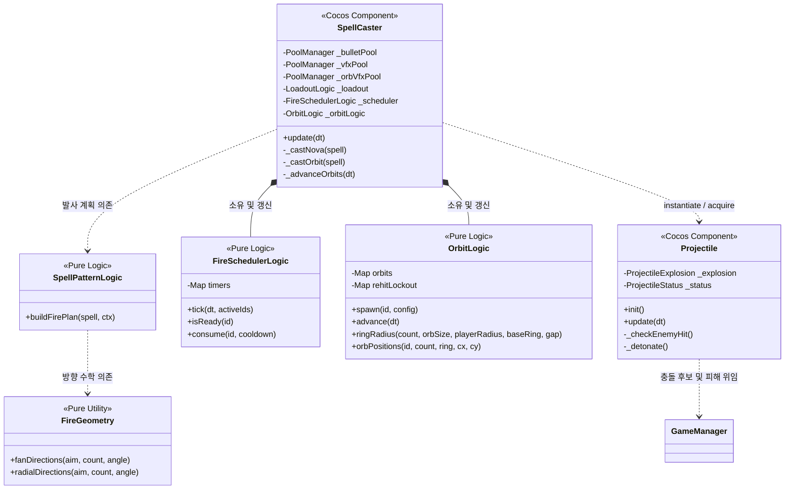

# ⚔️ 마법 및 전투 시스템 상세 분석 (Combat & Spell System)

이 문서는 `monster` 프로젝트의 마법 시전, 발사체 궤적 계산, 그리고 전투 판정을 처리하는 핵심 메커니즘을 코드 수준에서 분석합니다.

---

## 1. 핵심 파일 관계도 (Diagram)

전투 시스템은 Cocos Creator의 라이프사이클에 종속되는 컴포넌트(Wrapper)와 순수 수학적 좌표/타이머 연산을 수행하는 TS 로직 클래스로 이중 레이어 구조를 가집니다.

---

## 2. 상세 흐름 분석 (Flow Detail)

### 2.1. 자동 발사 및 쿨다운 스케줄링 (Fire Scheduling)
1. **쿨다운 누적:** 
   [SpellCaster.ts](../../../game/assets/scripts/components/SpellCaster.ts)의 `update(dt)`가 실행되면 소유하고 있는 [FireSchedulerLogic.ts](../../../game/assets/scripts/logic/FireSchedulerLogic.ts)의 `tick(dt, spells)`를 매 프레임 호출합니다.
   * `timers` 맵에 등록되지 않은 신규 장착 마법은 남은 시간이 `0`으로 즉시 초기화되어 바로 발사 가능 상태가 됩니다.
   * 기존 마법들의 쿨다운은 프레임 델타 `dt`만큼 균등 차감됩니다.
2. **조준 타겟 검색:** 
   [SpellCaster.ts](../../../game/assets/scripts/components/SpellCaster.ts#L410-L427)는 플레이어 기준 최근접 유효 적 노드를 탐색하여 방향 단위 벡터 `aim`을 계산합니다.
3. **발사 분기:** 
   `isReady(id)`가 `true`인 마법에 대해 발사를 시작합니다.
   * **Nova (자기중심 AoE):** 조준(aim) 방향이나 적 존재 유무와 무관하게 쿨다운마다 즉각 발동하며, `consume()`으로 쿨다운을 리셋합니다.
   * **Orbit (궤도형):** 적 유무와 무관하게 쿨다운마다 인스턴스를 재갱신(`_castOrbit`)합니다.
   * **Directional (발사체형):** 최근접 조준 벡터 `aim`이 유효할 때만 발사합니다. 적이 없어 발사를 미루면 `consume`이 호출되지 않아 쿨다운 타이머는 `0` 상태를 유지하고, 적이 등장하자마자 즉시 격발합니다.

---

## 3. 발사체 생성 및 패턴 기하학 (Projectile Pattern & Geometry)
*   **다발 발사 방향 계산:** 
    [SpellPatternLogic.ts](../../../game/assets/scripts/logic/SpellPatternLogic.ts)의 `buildFirePlan()`은 마법 패턴(`SpellPattern.Directional` 등)과 유효 투사체 개수(`count`)를 결합해 [FireGeometry.ts](../../../game/assets/scripts/logic/FireGeometry.ts)로 벡터를 연산합니다.
    *   **부채꼴(fanDirections):** aim 벡터를 중심으로 균등하게 부채꼴 각도(`spreadAngleDeg`)만큼 퍼져나가는 방향 리스트를 반환합니다.
        $$\text{offsetDeg} = -\frac{\text{spreadAngle}}{2} + \frac{i \times \text{spreadAngle}}{n - 1}$$
    *   **링(radialDirections):** 탄막 생성용 확산 각도로, 360도를 $n$으로 나누어 회전시키되 첫 점과 끝 점이 중복으로 겹쳐서 스폰되지 않도록 끝점을 배제합니다.
*   **발사체 풀링 초기화:** 
    계산된 방향에 맞춰 `PoolManager`에서 [Projectile.ts](../../../game/assets/scripts/components/Projectile.ts) 노드를 꺼내 `init()`합니다.
    이때 최종 곱산 배율이 반영된 데미지 및 폭발 범위/CC 옵션을 주입합니다.

---

## 4. 명중 판정 및 폭발/CC 처리 (Hit Resolution & Explosion & CC)
*   **제곱거리 충돌 검사 (Optimization):** 
    [Projectile.ts](../../../game/assets/scripts/components/Projectile.ts#L105-L130)는 매 프레임 이동 후 Spatial Grid에서 후보 몬스터 목록을 수집한 후, 무거운 제곱근(`sqrt`) 계산을 회피하고자 제곱거리 비교 공식을 사용하여 충돌을 판정합니다.
    $$\text{dx}^2 + \text{dy}^2 < (R_{\text{projectile}} + R_{\text{enemy}})^2$$
*   **단일 타격 vs 폭발 (AoE) 분기:**
    *   **단일 마법:** 대상에게 직격 피해를 입히고, 마법 데이터에 `onHitStatus`가 명시된 경우 [StatusEffectLogic.ts](../../../game/assets/scripts/logic/StatusEffectLogic.ts)의 `shouldApplyControl` 순수 함수를 거쳐 확률적으로 CC(정지, 슬로우, 빙결)를 겁니다.
    *   **폭발 마법:** 직격 데미지 없이 명중점을 중심으로 하는 광역 폭발 피해(`_detonate`)만 가합니다.
*   **시전 단위 중복 피해 방지 (Dedup):** 
    동시에 발사된 여러 발사체의 폭발 영역이 겹칠 때 한 마리의 몬스터가 중복으로 피해를 받아 순식간에 녹아내리는 현상을 차단하기 위해, 한 번의 시전(`volley`)에 속한 발사체들은 단일 `hitSet` 참조 인스턴스를 공유합니다.
    [ExplosionLogic.ts](../../../game/assets/scripts/logic/ExplosionLogic.ts)의 `selectExplosionHits`는 이 `hitSet`에 기록되지 않은 몬스터에만 피해를 입히고 ID를 `hitSet`에 영구 등록합니다.

---

## 5. 궤도 회전 시스템 (Orbit System Detail)

궤도 마법(예: 인페르노)은 발사체와 별개로 플레이어 주변을 공전하며 다중 타격 및 간격 규칙을 고유하게 가져갑니다.

### 5.1. 각도 보존 단일 인스턴스 설계 (Angle Preservation)
*   [OrbitLogic.ts](../../../game/assets/scripts/logic/OrbitLogic.ts#L73-L83)의 `spawn()`은 쿨다운 만료로 궤도 마법을 재시전할 때 새로 인스턴스를 생성하지 않고 기존 `OrbitState`를 덮어씁니다.
*   이때 누적 회전각 `theta`를 초기화하지 않고 그대로 유지하여, 재시전 시 돌고 있던 오브의 각도가 튀어 비주얼적으로 부자연스럽게 점프하는 버그를 완벽하게 방지합니다.

### 5.2. 충돌 겹침 및 파묻힘 방지 반경 계산 (Dynamic Ring Radius)
오브의 수(`count`)나 충돌 크기(`orbSize`)가 늘어날 때 비주얼적 겹침을 방지하고 플레이어 피격 충돌 범위 내에 오브가 파묻히는 것을 물리적으로 막고자 동적 반경 계산 알고리즘을 사용합니다.
1.  **오브 간 겹침 방지 반경 ($R_{\text{spacing}}$):** 
    오브 중심간 현의 길이가 $2 \times \text{orbSize}$ 이상으로 벌어지도록 현악(Chord) 공식을 적용합니다.
    $$R_{\text{spacing}} \geq \frac{\text{orbSize} \times (1 + \text{gap})}{\sin(\pi / N)}$$
2.  **플레이어 파묻힘 방지 반경 ($R_{\text{clearance}}$):** 
    $$R_{\text{clearance}} = R_{\text{player}} + R_{\text{orb}} + \text{MARGIN}$$
3.  **최종 적용 반경 ($R$):**
    $$R = \max(R_{\text{spacing}}, R_{\text{clearance}}, R_{\text{base}})$$

### 5.3. 오브 개별 재타격 락아웃 (Rehit Lockout)
*   오브가 몬스터를 관통하여 지나갈 때 매 프레임 다중 명중이 들어가 몬스터가 폭사하는 버그를 억제하기 위해 독립 락아웃 테이블을 관리합니다.
*   `canHit` / `registerHit`은 `${spellId}:${orbIndex}:${spawnId}` 형태의 고유한 키를 기준으로 락아웃 타이머(`rehitCooldownSec`)를 주입하고 매 프레임 `tickRehit(dt)`으로 잔여 시간을 차감하여 정확한 명중 간격을 물리적으로 보증합니다.
