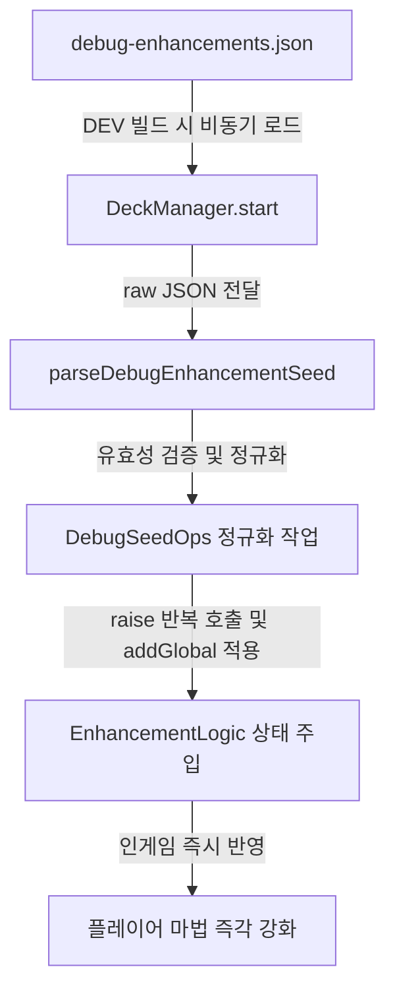

# 🛠️ 디버그 샌드박스 및 난수 제어 설계서 (Debug Tooling & Seed Sandbox)

이 문서는 `monster` 프로젝트 개발 단계에서 마법 및 카드 시스템의 밸런싱과 동작을 고속 검증하기 위해 도입된 DEV 전용 난수 시드 제어 시스템 및 디버그 툴링 아키텍처를 분석합니다.

---

## 1. DEV 강화 시드 제어 시스템 개요

카드를 랜덤으로 드로우하고 선택하는 로그라이크 게임 구조상, 특정 마법의 4레벨 풀 강화 모션이나 다발 발사에 따른 물리 부하를 테스트하려면 매번 오랜 시간 플레이를 수행해 카드를 운 좋게 집어야 하는 테스트 비용의 비효율이 발생합니다.
이를 극복하기 위해 디버그용 스탯 시드 시스템을 설계했습니다.



*   **배선 구조:** 
    [DeckManager.ts](../../../game/assets/scripts/systems/DeckManager.ts#L79-L87)의 `start()` 단계에서 `DEV` 상수 게이트가 열려 있는 경우에만 프로젝트 리소스 경로의 디버깅 설정 파일([debug-enhancements.json](../../../game/assets/resources/data/debug-enhancements.json))을 비동기로 강제 인출합니다.
*   **즉각 반영:** 
    가져온 데이터는 카드 선택 프로세스를 완전히 우회(Bypass)하여 마법 강화 트랙에 직접 레벨을 강제 적재합니다. 릴리스 빌드 시에는 트리쉐이킹 및 빌드 타임 코드 제외 처리를 거쳐 실제 프로덕션 패키지 크기나 데이터 유출에 무해하도록 격리됩니다.

---

## 2. 안전 파싱 및 무결성 정규화 (Robust Parsing)

디버그용 JSON 설정 파일은 개발자가 손으로 직접 텍스트 에디터에서 작성하므로, 실수로 지원하지 않는 강화 항목 문자열을 적거나(오타), 0~4레벨 범위를 넘어서는 비정상적인 수치 값을 적어 시스템 크래시를 유발할 수 있습니다. 
이를 예방하기 위해 [DebugEnhancementSeed.ts](../../../game/assets/scripts/logic/DebugEnhancementSeed.ts)의 `parseDebugEnhancementSeed` 순수 함수에서 다중 안전 필터를 적용합니다.

### 2.1. 옵션 이름 무결성 가드 (Option Gating)
데이터 테이블 상에서 수동으로 전달된 키가 실제 런타임 Enum 값에 포함되는 옵션인지 1차로 필터링합니다.
```typescript
const OPTION_VALUES = new Set<string>(Object.values(UpgradeOption));
function toOption(s: string): UpgradeOption | null {
  return OPTION_VALUES.has(s) ? (s as UpgradeOption) : null;
}
```
*   만약 `Option` 키 이름에 오타가 있거나 존재하지 않는 강화 능력 명세가 적힌 경우, 파싱 리스트에서 조용히 걸러내어 비정상적인 맵 적재를 차단합니다.

### 2.2. 정수 레벨 클램핑 및 비수치 가드 (Clamping)
*   레벨 항목에 문자열이나 `NaN`, 무한대(`Infinity`) 등이 잘못 전달된 경우 무조건 기본값인 `0`레벨로 치환합니다.
*   레벨이 정상 범위 외인 음수거나 4를 초과할 경우 범위 내로 클램프하여 강화 공식 곡선의 인덱스 바운드 초과 에러(`IndexOutOfBoundsException`)를 근본적으로 방어합니다.
```typescript
function clampLevel(n: unknown): number {
  if (typeof n !== 'number' || !Number.isFinite(n)) return 0;
  return Math.max(0, Math.min(UPGRADE_CAP, Math.floor(n)));
}
```
*   이렇게 정제된 `DebugSeedOps` 목록은 `DeckManager`가 해석하여, `raises`에 설정된 수치만큼 `raise`를 반복 호출하는 방식으로 강화 트랙 상태를 동기화합니다.
