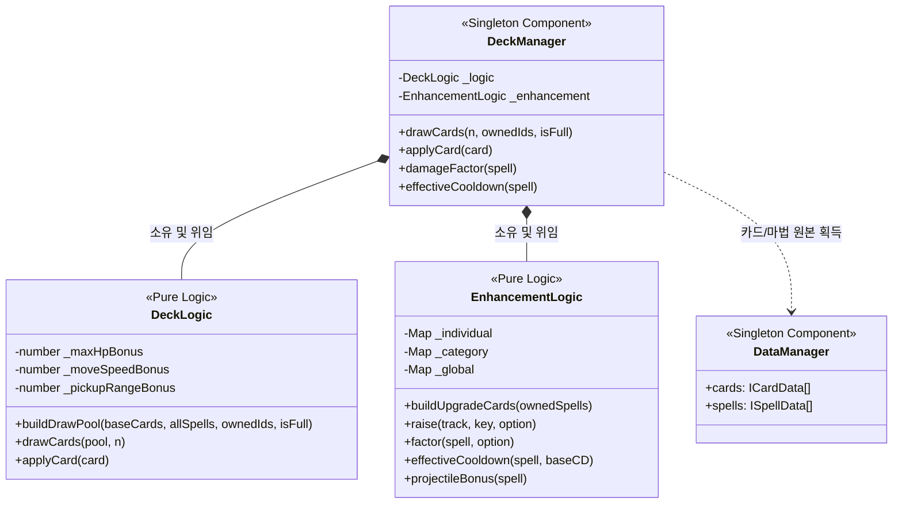

# 🃏 덱 및 카드 강화 시스템 상세 분석 (Deck & Card Enhancement System)

이 문서는 `monster` 프로젝트의 덱 드로우 풀 구성 규칙, 카드 선택에 따른 3-Tier 강화 배율 합산 메커니즘, 그리고 다발 발사에 수반되는 패널티 계산 방식을 분석합니다.

---

## 1. 핵심 파일 관계도 (Diagram)

덱 및 강화 시스템은 데이터 주도 방식으로 설계되어, 런타임 상태를 관리하는 싱글톤 매니저가 카드 합성 및 3-Tier 누적 트랙을 순수 클래스 로직에 위임하여 계산합니다.

---

## 2. 상세 흐름 분석 (Flow Detail)

### 2.1. 덱 구성 및 동적 카드 합성 (Draw Pool Creation)
*   [DeckLogic.ts](file:///F:/work/monster/game/assets/scripts/logic/DeckLogic.ts#L38-L67)의 `buildDrawPool`은 매 레벨업 시 드로우 대상이 되는 전체 카드 풀을 생성합니다.
*   **정적 카드 로드:** [DataManager.ts](file:///F:/work/monster/game/assets/scripts/systems/DataManager.ts)에서 로드한 기본 스펙 카드 목록([cards.json](file:///F:/work/monster/game/assets/resources/data/cards.json))에 다국어 해석용 `nameKey`, `descKey`를 부여합니다.
*   **미보유 마법 추가 카드 합성:** 
    *   플레이어가 보유하지 않은 마법(`allSpells` 중 `owned`에 없는 마법)만을 추출해 임시 `magic` 타입 카드로 즉석 합성합니다.
    *   따라서 기획서 상의 마법들을 파일 데이터에 일일이 카드 목록으로 하드코딩해 두지 않고 데이터 한 줄로 무한히 카드를 파생시킵니다.
    *   만약 보유 마법 개수가 한도에 도달한 상태(`isFull` = `true`)라면 마법 추가 카드 합성을 차단하여 플레이어가 강제로 추가 슬롯을 여는 버그를 예방합니다.
*   **동적 강화 카드 합성:** 
    *   [EnhancementLogic.ts](file:///F:/work/monster/game/assets/scripts/logic/EnhancementLogic.ts#L352-L388)의 `buildUpgradeCards`는 현재 플레이어가 장착하고 있는 마법에 대한 **개별 강화 카드**와 속성 분류(**분류 강화 카드**)를 동적으로 합성해 풀에 더합니다.
    *   강화 레벨 상한(`UPGRADE_CAP` = 4)에 도달한 옵션은 루프에서 차단되어 드로우 풀에서 영구 제외됩니다.

---

### 2.2. 적격 마법 Gating (Range & Duration)
강화 카드가 합성될 때 실질적인 효용이 없는 쓸모없는 선택지가 풀을 오염시키는 현상을 방지하고자 엄격한 적격성 검증 게이트를 둡니다.
1.  **범위(Range) 강화 게이트:** 
    `explosionRadius`나 `orbitRadius`가 명시된 마법만 범위 카드를 합성합니다.
2.  **지속시간(Duration) 강화 게이트:** 
    상태이상이 있는 마법(`onHitStatus` 보유)이나 활성 수명이 존재하는 궤도 마법(`lifetimeSec` 보유)에 한해서만 지속시간 카드를 합성합니다.
3.  **발사체 수(ProjectileCount) 게이트:** 
    `allowsProjectileCount`가 `false`인 자기중심 광역기(Nova 등)는 개별/분류 강화 카드 합성 풀에서 제외됩니다.

---

## 3. 3-Tier 강화 및 페널티 공식 (Enhancement Formulas)

이 프로젝트는 동일 계열 보너스를 중첩 적용할 때 아래와 같이 명확한 위계 곡선과 합산 공식을 적용합니다.

### 3.1. 곱산 합산 공식 (3-Tier Multiplicative)
데미지와 쿨다운 배율은 개별 트랙 곡선 배율, 분류 트랙 곡선 배율, 그리고 카드 픽으로 누적되는 전역(플레이어) 보너스를 곱하여 산출합니다.
$$\text{Factor} = \text{Curve}_{\text{indiv}}[L_{\text{indiv}}] \times \text{Curve}_{\text{cat}}[L_{\text{cat}}] \times (1 + G_{\text{bonus}})$$

*   **곡선 정의:**
    *   **개별 곡선 (`INDIVIDUAL_CURVE`):** `[1.0, 1.3, 1.65, 2.05, 2.5]` (레벨당 상승폭이 가장 큼)
    *   **분류 곡선 (`CATEGORY_CURVE`):** `[1.0, 1.2, 1.4, 1.7, 2.05]` (상승폭 중간)
*   **쿨다운 최소 보증:** 
    쿨다운 배율이 급격히 증가하더라도 연사 속도가 0에 수렴해 게임이 멈추는 현상을 막기 위해 0.05초의 강력한 하한(`MIN_COOLDOWN_SEC`)을 적용합니다.
    $$\text{Cooldown}_{\text{effective}} = \max\left(\frac{\text{Cooldown}_{\text{base}}}{\text{Factor}_{\text{cooldown}}}, 0.05\right)$$

### 3.2. 발사체 수 가산 및 데미지 페널티 메커니즘 (Projectile Penalty)
*   **발사체 수 가산:** 
    발사체 개수는 데미지/쿨다운과 달리 비선형 곡선을 타지 않고 개별 레벨과 분류 레벨을 단순히 더해 1발씩 추가합니다.
    $$\text{Bonus} = L_{\text{indiv, ProjectileCount}} + L_{\text{cat, ProjectileCount}}$$
*   **발사체당 데미지 페널티 배율:** 
    발사체가 증가할수록 단일 탄환의 파괴력을 일부 상실시키는 페널티($r = 0.1$)를 부여하여 밸런스를 조율합니다.
    $$\text{PenaltyFactor} = \max(0.05, 1 - 0.1 \times \text{Bonus})$$
    이로 인해 다발 샷이 전체 적에게 다 맞았을 때의 총 데미지 출력은 가중되어 $O(N)$으로 늘어나지만, 단일 탄환의 위력은 약화되는 설계가 성립됩니다.
