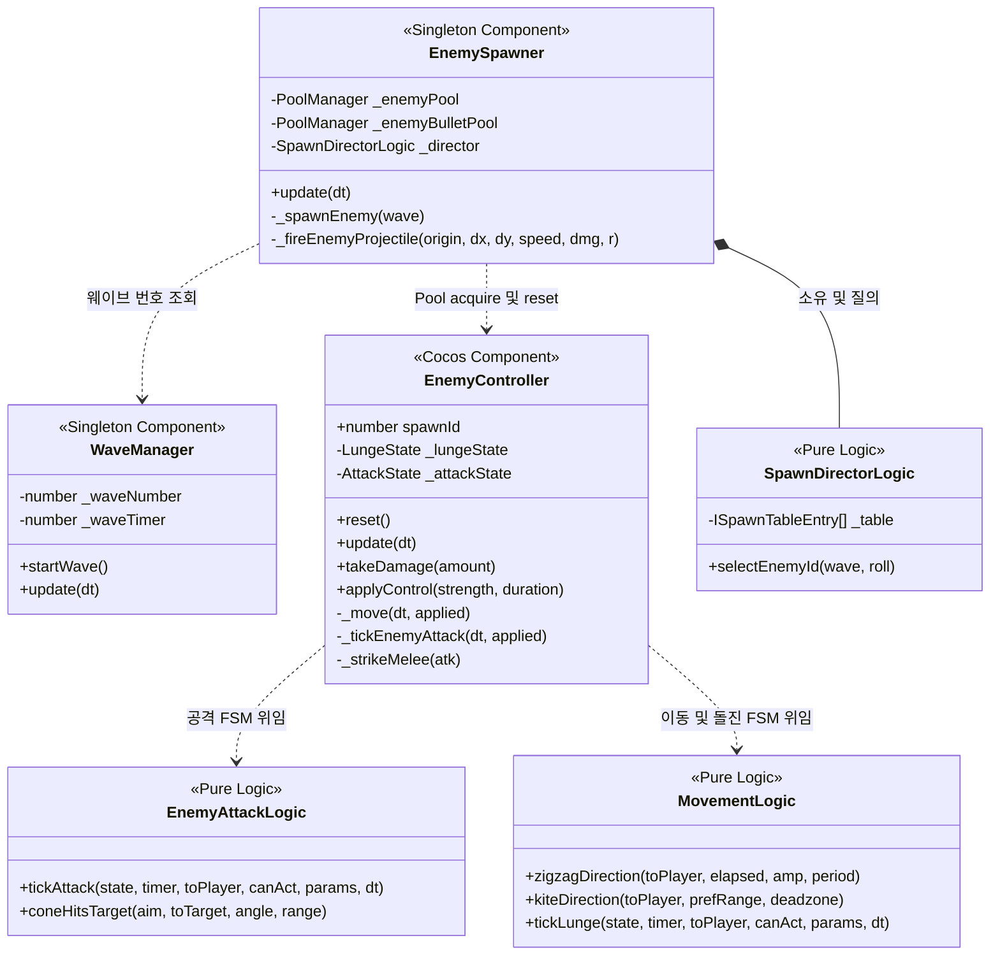

# 👾 몬스터, 웨이브 및 최적화 시스템 상세 분석 (Enemy, Wave & Spawning System)

이 문서는 `monster` 프로젝트의 웨이브 기반 몬스터 스폰 디렉션, 적 AI 행동 패턴 상태 기계(FSM), 그리고 수백 마리의 몬스터 연산 시 부하를 막기 위한 조율 코드를 깊이 있게 분석합니다.

---

## 1. 핵심 파일 관계도 (Diagram)

몬스터 시스템은 웨이브 상태를 주적하는 `WaveManager`와 몬스터들의 물리 프리팹을 스폰하는 `EnemySpawner`, 그리고 몬스터 개별 행동 패턴을 제어하는 `EnemyController`가 순수 로직 모듈들과 긴밀히 연계되어 구동됩니다.

---

## 2. 상세 흐름 분석 (Flow Detail)

### 2.1. 웨이브 기반 몬스터 스폰 디렉션 (Spawning Direction)
*   **구간 스폰 가중치 테이블:** 
    [SpawnDirectorLogic.ts](file:///F:/work/monster/game/assets/scripts/logic/SpawnDirectorLogic.ts)는 기획 테이블([spawn-table.json](file:///F:/work/monster/game/assets/resources/data/spawn-table.json))을 `fromWave` 기준 오름차순으로 정렬하여 적재합니다.
*   **구간 맵핑 및 가중치 선택:**
    *   현재 웨이브 값 이하인 가장 큰 `fromWave`를 지닌 엔트리를 선출합니다.
    *   `selectEnemyId(wave, Math.random())` 호출 시 주입된 난수를 가중치의 총합(`total`) 영역에 비례하여 구간별로 누적 적재하며 매핑하는 가중치 비례 선택 알고리즘을 사용합니다.
    *   난수 주입식을 사용하여 생성자 검증 및 단위 테스트 환경에서도 결정적인 몬스터 선출 보정이 가능하도록 고안되었습니다.

---

## 3. 적 AI 상태 기계 및 행동 패턴 (Enemy AI FSM)

[EnemyController.ts](file:///F:/work/monster/game/assets/scripts/components/EnemyController.ts)는 개체의 복잡한 이동 및 공격 패턴을 상태 기계(FSM) 모듈에 위임하여 처리합니다.

### 3.1. 지그재그 이동 (Zigzag - 어둑시니)
[MovementLogic.ts](file:///F:/work/monster/game/assets/scripts/logic/MovementLogic.ts#L106-L121)의 `zigzagDirection`을 사용합니다. 플레이어를 조준한 전진 벡터에 수직인 방향 성분을 구하고, 프레임 경과 시간 누적 시계에 맞춰 삼각함수(Sin) 값으로 사인파 오프셋을 더합니다.
$$\text{수직 벡터} = (-y_{\text{toPlayer}}, x_{\text{toPlayer}})$$
$$\text{Offset} = \text{수직 벡터} \times \sin\left(\frac{2\pi \times \text{elapsed}}{\text{period}}\right) \times \text{amplitude}$$

### 3.2. 유격 이동 (Kite - 구미호)
[MovementLogic.ts](file:///F:/work/monster/game/assets/scripts/logic/MovementLogic.ts#L129-L149)의 `kiteDirection`을 사용합니다. 플레이어와 적 사이의 거리를 측정하여:
*   선호 거리(`preferredRange`) + 데드존 반경보다 멀면 플레이어를 향해 접근합니다.
*   선호 거리 - 데드존 반경보다 가까우면 플레이어의 역방향으로 후퇴합니다.
*   오차 대역인 데드존(`KITE_DEADZONE_BAND` = 40px) 밴드 구간 안에서는 떨림 현상을 방지하기 위해 속도를 0으로 설정하여 멈춥니다.

### 3.3. 돌진 공격 (Lunge - 불가사리)
돌진 이동 FSM은 `Chase` -> `Windup` -> `Lunge` -> `Cooldown` 단계를 가집니다.
*   [MovementLogic.ts](file:///F:/work/monster/game/assets/scripts/logic/MovementLogic.ts#L226-L255)의 `tickLunge`를 통해 트리거됩니다.
*   **Windup (텔레그래프 경고):** 돌진하기 전 플레이어 방향으로 각도를 잠그고(`_lockDir` 래치), 붉은색 윈드업 점멸 연출과 바닥 마커(`lungeMarker`) 스케일을 주입합니다.
*   **Lunge (돌진 돌파):** 잠긴 방향으로 빠르게 돌진합니다.
*   **락아웃 동결 최적화:** 정지나 빙결 등의 CC에 적이 걸린 경우 FSM 타이머 진행과 속도를 완전히 동결하여, CC가 풀린 이후에 남아있던 공격/돌진 동작을 의도치 않게 공중에서 실행하지 않고 쿨다운을 정상 이행하게 합니다.

### 3.4. 근접 부채꼴 휘두르기 (Melee Sweep - 그슨대)
공격 FSM은 `Aim` -> `Telegraph` -> `Fire` -> `Cooldown` 단계를 거칩니다.
*   **Telegraph (범위 그리기):** 윈드업 진입 에지 시점에 로컬 +X를 기준으로 반투명 부채꼴 마커(`meleeConeMarker`)를 `Graphics` 컴포넌트로 1회 그립니다.
*   **사거리 대기 조율 ( local anti-overlap ):** 
    근접 휘두르기형 적은 플레이어 위치 좌표에 완전히 도달해 겹쳐서 다닥다닥 붙기 전에, 자신의 가격 범위 사거리 경계선 근처(`_holdAtMeleeRange()`)에 정지하여 대기하도록 조율합니다.
    이로 인해 플레이어가 적의 모션을 관측하고 회피할 수 있는 공간이 보장됩니다.
*   **Fire (각도 물리 판정):**
    공격 발동 시점에 윈드업 때 고정해 둔 조준 벡터와 플레이어 사이의 각도를 내적($\cos\theta$)하여 범위 명중을 판정합니다.
    $$\text{Angle} = \arccos\left(\frac{\mathbf{u} \cdot \mathbf{v}}{\|\mathbf{u}\|\|\mathbf{v}\|}\right) \leq \frac{\text{coneAngleDeg}}{2}$$
