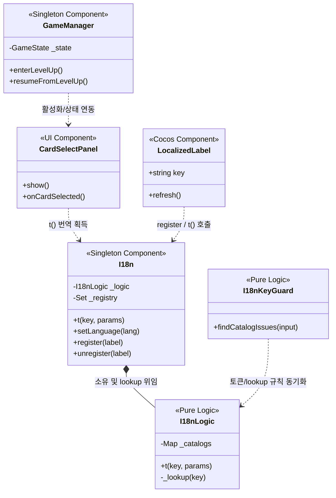

# 🌐 UI 및 다국어 시스템 상세 분석 (UI & Internationalization System)

이 문서는 `monster` 프로젝트의 게임 루프 연계 UI 패널 제어 흐름, 비동기 번역 리소스 로드 및 라벨 동적 갱신 옵저버 아키텍처, 그리고 번역 데이터 무결성을 보장하는 정합 가드 엔진을 분석합니다.

---

## 1. 핵심 파일 관계도 (Diagram)

UI 시스템은 상태 관리 매니저의 전이에 맞춰 다양한 패널을 제어하고, 다국어 처리 싱글톤 `I18n`이 로직 단과 격리되어 번역 텍스트를 공급합니다.

---

## 2. 상세 흐름 분석 (Flow Detail)

### 2.1. 게임 상태 기계 연계 UI 제어 (UI Flow & FSM)
*   **레벨업 패널 트리거:** 
    플레이어가 경험치 픽업 범위를 넓혀 요구치에 도달하면 `ExperienceManager`가 이벤트를 발생시키고 `GameManager.enterLevelUp()`이 호출됩니다.
    *   게임 루프의 물리/투사체 틱 진행을 전면 일시정지(`GameState.LevelUp`)시킵니다.
    *   [CardSelectPanel.ts](file:///F:/work/monster/game/assets/scripts/ui/CardSelectPanel.ts)가 화면에 표시되고, `DeckManager`를 통해 드로우된 카드 리스트의 번역 키를 해석해 카드를 렌더링합니다.
*   **카드 선택 완료:** 카드가 선택되면 3-Tier 강화 데이터에 누적시킨 뒤, 즉시 `GameManager.resumeFromLevelUp()`을 호출하여 패널을 닫고 원래 플레이 속도로 게임을 이행합니다.

---

### 2.2. 다국어 로딩 및 옵저버 라벨 관리 (Observer pattern)
*   **DataManager 선결 조건 게이팅:** 
    다국어 리소스 로드가 늦어 화면 라벨에 로우 데이터 번역 키(예: `spell.fireball.name`)가 노출되는 현상을 방지하고자, `I18n` 싱글톤 클래스는 `executionOrder(-1)`을 가져가 씬 로드 시 가장 먼저 메모리에 상주하고 [I18n.ts](file:///F:/work/monster/game/assets/systems/I18n.ts#L88-L101)의 비동기 `Promise.all`로 언어 팩들을 병렬 적재합니다.
*   **라벨 레지스트리 (Observer Pattern):**
    *   씬 내 노드에 부착된 [LocalizedLabel.ts](file:///F:/work/monster/game/assets/scripts/ui/LocalizedLabel.ts) 컴포넌트는 Cocos 수명주기인 `onEnable()` 시점에 전역 `I18n` 레지스트리에 자신을 스스로 등록(`register`)합니다.
    *   언어 리소스 로드 완료 에지 또는 런타임 언어 스위칭(`setLanguage`) 발생 시, `I18n`이 보관하던 레지스트리 `Set`을 전수 순회하여 등록된 모든 라벨들의 `refresh()` 함수를 호출함으로써 일괄적으로 다국어 텍스트를 실시간 치환합니다.
    *   컴포넌트 비활성화(`onDisable`) 및 노드 해제 시 레지스트리에서 자동 제외(`unregister`)시켜 메모리 누수를 원천 차단합니다.

---

## 3. 번역 및 정합성 검증 엔진 (Translation & I18nKeyGuard)

[I18nLogic.ts](file:///F:/work/monster/game/assets/scripts/logic/I18nLogic.ts)와 [I18nKeyGuard.ts](file:///F:/work/monster/game/assets/scripts/logic/I18nKeyGuard.ts)는 기획 번역 팩의 오류 및 누락을 감지하고 폴백을 보장하는 순수 엔진입니다.

### 3.1. 번역 조회 및 폴백 체인 (Fallback Chain)
`t(key, params)` 호출 시 다국어 번역을 찾기 위해 체인 구조를 타고 내려갑니다.
1.  **활성 언어 검출:** `activeLang` 카탈로그에서 해당 키를 추출합니다. 빈 문자열(`""`)은 미번역으로 인식해 건너뜁니다.
2.  **기본 언어 폴백:** 활성 언어에 번역이 없는 경우, 소스 언어(기본값: `ko`) 카탈로그에서 동일한 키를 검색합니다.
3.  **생 키 노출 폴백:** 두 곳 모두 번역이 정의되지 않았을 경우, 크래시를 방지하기 위해 입력받은 `key` 문자열 자체를 리턴합니다.
4.  **토큰 보간:** 메시지 내 `{paramName}` 토큰이 발견되면 `replace` 정규식으로 주입 파라미터 값으로 치환하되, 일치하는 치환 인자가 누락된 경우 토큰명 자체를 화면에 보존시켜 개발 단계에서 피드백을 유도합니다.

### 3.2. 4대 번역 이슈 검출 알고리즘 (I18nKeyGuard Issues)
번역의 정합성을 검증하기 위해 TS 코드 스캔 리터럴과 JSON 데이터 도메인으로부터 파생된 키 리스트를 합성하여 4종 오류를 연산합니다.
1.  **Missing (생키 노출):** 소스 코드 및 데이터셋에서 쓰이는데 번역 파일(`ko.json`)에 누락된 키.
    $$\text{MissingKeys} = \text{ExpectedKeys} \setminus \text{Keys}_{\text{ko}}$$
2.  **Orphan (고아 번역):** 번역 파일에는 정의되어 있으나 실제 소스 및 데이터 기획상 어디서도 사용되지 않는 고아 키 (단, 씬 정적 컴포넌트 프리픽스 `menu.`, `result.` 등은 예외 처리).
    $$\text{OrphanKeys} = \text{Keys}_{\text{ko}} \setminus \text{ExpectedKeys}$$
3.  **EnOrphan (영어 번역 오타):** 영어 번역 팩(`en.json`)에만 존재하고 한글 번역 팩(`ko.json`)에는 존재하지 않는 정렬 오류 키.
    $$\text{EnOrphanKeys} = \text{Keys}_{\text{en}} \setminus \text{Keys}_{\text{ko}}$$
4.  **ParamMismatch (토큰 정합 오류):** 한/영 번역 팩 모두에 존재하나 영어 번역 팩에 들어있는 토큰 인자 중 한글 번역 팩에 선언되어 있지 않은 치환 토큰이 섞여 있는 불일치 오류.
    $$\text{Tokens}_{\text{en}} \not\subseteq \text{Tokens}_{\text{ko}}$$
    이 네 가지 검증 프로세스는 CI 단계에서 단위 테스트의 게이트웨이 역할을 완수합니다.
