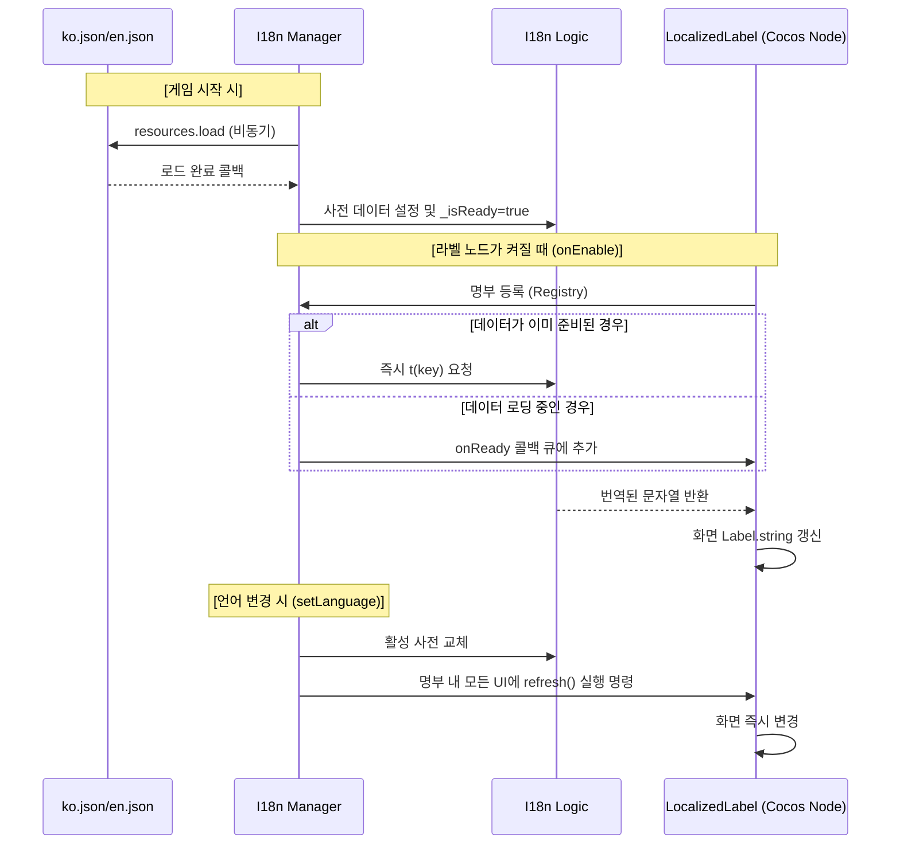

# 다국어(i18n) 시스템 기술 가이드 (Deep Dive)

이 문서는 프로젝트 내 다국어 처리가 Cocos Creator의 라이프사이클과 어떻게 정밀하게 결합되어 작동하는지 상세히 설명합니다.

---

## 1. 초기화 프로세스 (Systems/Managers)

시스템의 기점인 `I18n.ts`는 싱글톤 매니저로서 데이터 로드와 배포를 총괄합니다.

| 라이프사이클 | 동작 내용 | 비고 |
| :--- | :--- | :--- |
| **`onLoad()`** | `I18n.instance` 할당. 정적 접근성 확보. | 최우선 실행 |
| **`start()`** | `resources.load`를 통한 JSON 파일 비동기 로드 개시. | 비동기 시작 |
| **Callback** | 로드 완료 후 `I18nLogic`에 데이터 주입 및 `_isReady` 플래그 활성화. | 데이터 준비 완료 |

---

## 2. UI 컴포넌트 라이프사이클 연동 (`LocalizedLabel.ts`)

씬의 각 라벨은 자신의 상태에 따라 매니저와 통신하며 텍스트를 유지합니다.

### 2.1. 라이프사이클 상세
1. **`onLoad()`**
   - 현재 노드에서 `cc.Label` 컴포넌트를 미리 캐싱하여 `update` 시점의 성능을 확보합니다.
2. **`onEnable()` (핵심)**
   - **Registry 등록:** `I18n.instance.register(this)` 호출.
   - **상태 체크:** 매니저가 준비(`_isReady`) 상태면 즉시 번역, 아니면 `onReady` 콜백 큐에 예약.
3. **`onDisable()`**
   - **Registry 해제:** `I18n.instance.unregister(this)` 호출.
   - 화면에서 사라진 노드는 갱신 대상에서 제외하여 불필요한 연산 및 에러를 방지합니다.
4. **`onDestroy()`**
   - 메모리 누수 방지를 위한 최종 참조 해제.

---

## 3. 런타임 언어 전환 (Runtime Language Switch)

게임을 재시작하지 않고 언어를 변경할 때의 내부 시퀀스입니다.

1. **API 호출:** 사용자가 `I18n.instance.setLanguage('en')`을 호출합니다.
2. **사전 교체:** 매니저 내부의 `I18nLogic` 사전을 영어 데이터로 교체합니다.
3. **옵저버 패턴 실행:** 매니저가 `onEnable` 상태로 등록된 모든 `LocalizedLabel` 목록을 순회합니다.
4. **동적 갱신:** 각 라벨의 `refresh()`를 호출하여 새로운 언어로 `label.string`을 즉시 업데이트합니다.

---

## 4. 아키텍처 원칙: Logic과 UI의 철저한 분리

- **Pure Logic (`logic/I18nLogic.ts`):** 
  - Cocos 엔진(`cc`) 임포트 금지. 
  - 오직 문자열 매칭, `{param}` 치환, 폴백(ko -> key) 로직만 담당.
  - Vitest를 통한 고속 단위 테스트 지원.
- **Cocos Wrapper (`systems/I18n.ts`):** 
  - 리소스 로드, 싱글톤 관리, UI 컴포넌트 목록(Registry) 관리 담당.

---

## 5. 레이스 컨디션 (Race Condition) 방어

- **상황:** 씬 로딩은 끝났으나 네트워크/파일 로딩 지연으로 번역 파일이 아직 도착하지 않은 경우.
- **대응:** `LocalizedLabel`은 즉시 실행 대신 `I18n.onReady` 콜백을 등록합니다. 매니저는 파일 로드가 끝나는 즉시 대기 중인 모든 라벨의 번역을 일괄 수행합니다.

---

## 6. 요약 다이어그램

