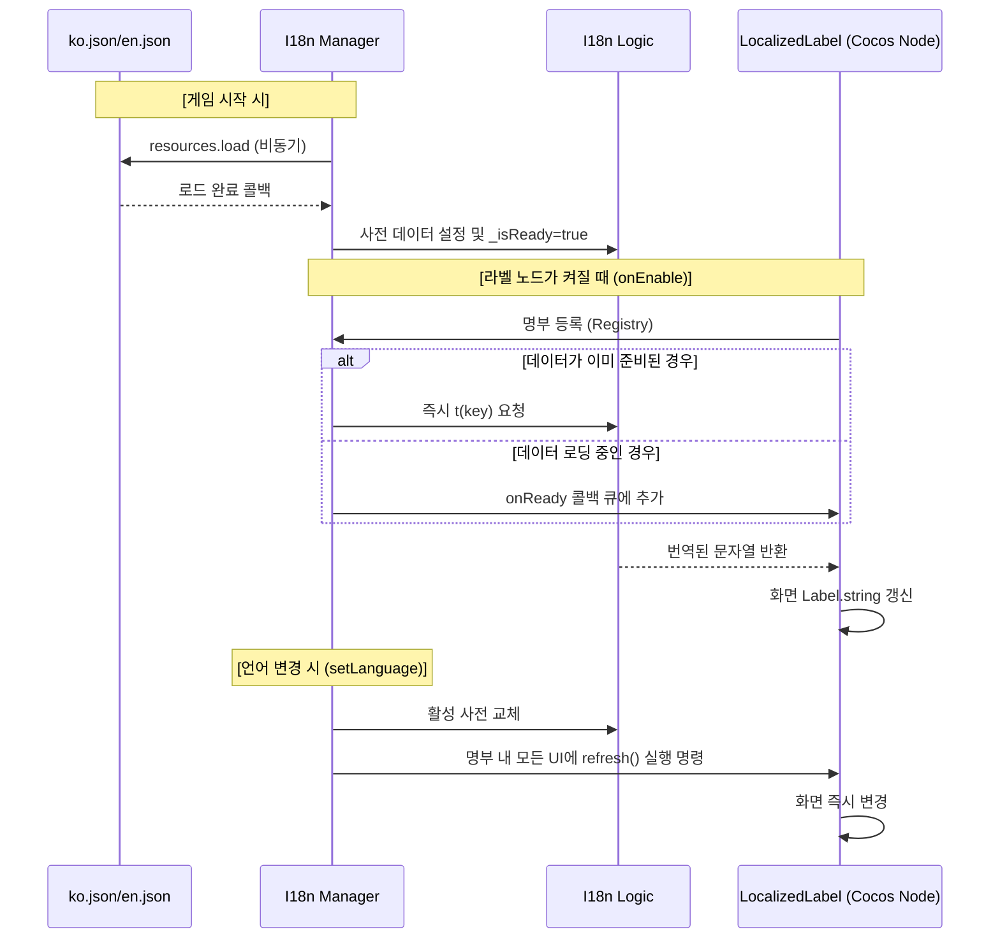

# 다국어(i18n) 시스템 기술 가이드 (Deep Dive)

> 화면 글자를 어떻게 번역하고, 새 글자는 어느 방식으로 만드나

- **최초 작성:** 2026-06-11
- **상태:** CONFIRMED
- **이력:** 2026-08-13 — `spec/`으로 이전(`i18n-guide.md` → `code-i18n.md`). 두 방식 중 무엇을 고르는지를 답하는 §8을 신설하고, §1~§6의 문체를 나머지 문서와 맞췄다

---

다국어 처리가 Cocos Creator의 라이프사이클과 어떻게 맞물려 도는지를 적는다.

---

## 1. 초기화 프로세스 (Systems/Managers)

시스템의 기점인 `I18n.ts`는 싱글톤 매니저로서 데이터 로드와 배포를 총괄한다.

| 라이프사이클 | 동작 내용 | 비고 |
| :--- | :--- | :--- |
| **`onLoad()`** | `I18n.instance`를 할당해 정적 접근을 연다. | 최우선 실행 |
| **`start()`** | `resources.load`로 JSON 파일 비동기 로드를 시작한다. | 비동기 시작 |
| **Callback** | 로드가 끝나면 `I18nLogic`에 데이터를 넣고 `_isReady`를 켠다. | 데이터 준비 완료 |

---

## 2. UI 컴포넌트 라이프사이클 연동 (`LocalizedLabel.ts`)

씬의 각 라벨은 자기 상태에 따라 매니저와 주고받으며 텍스트를 유지한다.

### 2.1. 라이프사이클 상세
1. **`onLoad()`**
   - 현재 노드의 `cc.Label` 컴포넌트를 미리 캐싱해 갱신 시점의 비용을 줄인다.
2. **`onEnable()` (핵심)**
   - **Registry 등록:** `I18n.instance.register(this)`를 부른다.
   - **상태 확인:** 매니저가 준비(`_isReady`)됐으면 즉시 번역하고, 아니면 `onReady` 콜백 큐에 예약한다.
3. **`onDisable()`**
   - **Registry 해제:** `I18n.instance.unregister(this)`를 부른다.
   - 화면에서 사라진 노드를 갱신 대상에서 빼서 헛된 연산과 에러를 막는다.
4. **`onDestroy()`**
   - 참조를 끊어 누수를 막는다.

---

## 3. 런타임 언어 전환 (Runtime Language Switch)

게임을 재시작하지 않고 언어를 바꿀 때의 내부 순서다.

1. **API 호출:** `I18n.instance.setLanguage('en')`을 부른다.
2. **사전 교체:** 매니저 내부의 `I18nLogic` 사전을 영어 데이터로 갈아 끼운다.
3. **명부 순회:** 매니저가 `onEnable` 상태로 등록된 모든 `LocalizedLabel`을 훑는다.
4. **동적 갱신:** 각 라벨의 `refresh()`를 불러 `label.string`을 새 언어로 즉시 바꾼다.

---

## 4. 아키텍처 원칙: Logic과 UI의 철저한 분리

- **Pure Logic (`logic/I18nLogic.ts`)**
  - Cocos 엔진(`cc`)을 import하지 않는다.
  - 문자열 매칭, `{param}` 치환, 폴백(ko → 키)만 맡는다.
  - 그래서 vitest가 엔진 없이 빠르게 돌릴 수 있다.
- **Cocos Wrapper (`systems/I18n.ts`)**
  - 리소스 로드, 싱글톤 관리, UI 컴포넌트 명부(Registry) 관리를 맡는다.

---

## 5. 레이스 컨디션 (Race Condition) 방어

씬 로딩은 끝났는데 파일 로딩이 늦어 번역 데이터가 아직 도착하지 않는 경우가 있다. 그래서 `LocalizedLabel`은 즉시 번역하는 대신 `I18n.onReady` 콜백을 등록하고, 매니저는 로드가 끝나는 즉시 대기 중인 모든 라벨의 번역을 한 번에 수행한다.

---

## 6. 요약 다이어그램

---

## 7. 키 정합 가드 (CI)

§1~§6은 카탈로그가 **이미 정합인 상태**에서 번역이 어떻게 흐르는지를 다룬다. 하지만 카탈로그(`ko.json`/`en.json`)와 그 키를 실제로 쓰는 코드·데이터는 서로 다른 파일이라 시간이 지나며 어긋난다 — AI가 여러 세션에 걸쳐 마법·카드를 추가하며 키를 깜빡하거나, ko만 고치고 사용처를 놓치면 화면에 `menu.ply` 같은 **생키 문자열**이 그대로 노출된다. 이를 사람이 매번 눈으로 잡을 수는 없으므로, vitest 영구 게이트로 **CI에서 자동 차단**한다. 순수 로직은 `tests/helpers/I18nKeyGuard.ts`의 `findCatalogIssues`이고, 파일을 읽고 소스를 스캔하는 부분은 `tests/logic/I18nKeyGuard.test.ts`가 맡는다. (이 가드는 게임 런타임에서 한 줄도 돌지 않는 테스트 전용 헬퍼라, `feat/ts-toolchain`에서 `game/assets/scripts/logic/`을 떠나 `tests/helpers/`로 옮겼다.)

### 7.1. 잡는 이슈 4종

`findCatalogIssues`는 "코드·데이터가 기대하는 키 집합(expected)"과 "카탈로그에 실제로 있는 키"를 비교해 다음 네 가지를 산출한다. 이슈가 0건이면 정합이고, 한 건이라도 나오면 테스트가 실패(RED)한다.

| 종류 | 정의 | 증상 |
|------|------|------|
| **missing** | expected에 있으나 ko에 없음 | 플레이어에게 생키 노출 (최우선) |
| **orphan** | ko에 있으나 expected에 없음 | 죽은 키 / 오타 (씬 접두사는 제외) |
| **enOrphan** | en에만 있고 ko에 없음 | en 오타 (ko 폴백도 못 함) |
| **paramMismatch** | 공통 키에서 en이 ko에 없는 `{token}`을 씀 | 치환 누락 |

`paramMismatch`의 메시지·토큰 추출은 런타임 `I18nLogic`과 **같은 규칙**을 쓴다 — 엔트리가 객체면 `.message`, 문자열이면 그대로, 빈 문자열은 미번역으로 보고 미스 처리한다. 토큰 정규식도 `/\{(\w+)\}/g`로 동일하다. 가드가 런타임과 다른 규칙을 쓰면 게이트가 통과해도 실제로는 깨질 수 있어 일부러 맞췄다.

### 7.2. expected는 어디서 오나 — 정적 리터럴 + 동적 패밀리

가드가 "코드·데이터가 기대하는 키"를 알아야 하는데, 출처가 두 가지다.

- **정적 리터럴 키** — `.ts` 소스에 문자열 그대로 박힌 키. 테스트가 `game/assets/scripts/**/*.ts`를 스캔해 번역 함수 호출 인자(`t('hud.hp')`)와 `nameKey`/`descKey` 속성의 리터럴을 모은다. 이렇게 모은 값이 `usedLiterals`로 들어간다.
- **동적 패밀리 키** — 데이터에서 template literal로 조립되는 키. `buildFamilyKeys`가 도메인(데이터·enum)으로부터 전체를 만든다: `spell.<id>.name`(spells.json), `card.<id>.{name,desc}`(cards.json), `category.<cat>`(`SpellCategory`), `upgrade.<opt>`(`SLICE_OPTIONS`).

> **새 동적 패밀리를 도입하면** `buildFamilyKeys`에 도메인 한 줄을 추가해야 가드가 정합을 본다(예: 적 이름 키). `card.<id>`는 카드가 name·desc 키를 **둘 다** 갖는다는 전제라, 이름만 있는 카드가 생기면 desc가 missing으로 잡힌다.

### 7.3. 오탐을 막는 두 가지 장치

소스 스캔과 도메인 한정이 없으면 게이트가 i18n과 무관한 것까지 잡아 신뢰를 잃는다. 그래서 두 가지를 둔다.

- **씬 라벨 접두사 허용 목록** — `menu.`·`result.`·`gameover.` 키는 `.scene`에 박혀 있고 `.ts`에는 없다. 그대로 두면 orphan으로 오탐되므로 `sceneKeyPrefixes`로 시작하는 키는 orphan 검사에서 제외한다.
- **소스 스캔의 어휘 견고화** — 호출 정규식을 영숫자 경계로 앵커해(`/(?<![A-Za-z0-9])_?t\(['"]([^'"]+)/g`) 번역 함수와 `_t` 래퍼만 잡고 `emit`/`assert`/`getComponent` 같은 `t`로 끝나는 식별자는 배제한다. 또 스캔 전에 주석·JSDoc을 제거해(`stripComments`) 주석 속 `t('x')`가 가짜 사용 리터럴이 되는 것을 막는다. (`SLICE_OPTIONS`는 `damage`·`cooldown`·`projectile_count` 3종만 배선돼 있어 `upgrade.range/duration`이 카탈로그에 없는 것은 갭이 아니라 정상 — 도메인을 `SLICE_OPTIONS`로 한정해 자동으로 이슈에서 빠진다.)

---

## 8. 새 글자를 만들 때 무엇을 고르나

여기까지가 두 장치의 **작동 방식**이라면, 이 절은 **선택**을 정한다. 화면 글자를 새로 만들 때 씬 노드에 `LocalizedLabel`을 붙일지, 컨트롤러에서 `t()`를 부를지의 기준이다.

### 8.1. 기준은 "그 글자를 누가 정하느냐"다

| 그 라벨의 문자열은 | 방식 |
|---|---|
| 씬에 고정돼 있고 언어만 바뀐다 (버튼 이름, 화면 제목) | 씬 노드에 **`LocalizedLabel`** + `key` 프로퍼티 |
| 런타임 값이 섞인다 (수치·진행도·조합) | 컨트롤러에서 **`t(key, params)`** |
| 조건에 따라 다른 키가 된다 (승리/패배, 분류명) | 컨트롤러에서 **`t()`** — 키를 코드가 고른다 |

가르는 이유는 갱신 주체다. `LocalizedLabel`은 언어가 바뀔 때 매니저가 명부를 돌며 스스로 갱신하므로 컨트롤러가 그 라벨을 몰라도 된다. 반대로 값이 섞이는 라벨은 값이 바뀔 때마다 어차피 컨트롤러가 문자열을 다시 만들어야 하고, 그때 `t()`를 함께 부르는 것이 자연스럽다. 여기에 `LocalizedLabel`을 붙이면 매니저가 넣은 번역문을 컨트롤러가 곧바로 덮어써서, 붙인 컴포넌트가 아무 일도 하지 않는 채로 남는다.

### 8.2. 한 라벨에 둘을 겹치지 않는다

**이것이 이 절이 생긴 이유다.** 지금 `main.scene`의 일시정지 패널이 정확히 그 상태다.

| 노드 | 씬의 `LocalizedLabel` 키 | `PauseController`가 넣는 것 |
|---|---|---|
| `PausePanel/Title` | `pause.title` | `_t('pause.title')` |
| `PausePanel/ResumeButton/ResumeButtonLabel` | `pause.resume` | `_t('pause.resume')` |
| `PausePanel/RestartButton/RestartButtonLabel` | `pause.restart` | `_t('pause.restart')` |
| `PausePanel/MenuButton/MenuButtonLabel` | `pause.menu` | `_t('pause.menu')` |

같은 노드의 같은 키를 두 장치가 각각 쓰고 있다. 겹치면 두 가지가 잘못된다. 화면에 무엇이 뜨는지가 **어느 쪽이 나중에 도느냐**에 달리는데 그 순서는 매니저 준비 시점과 패널이 켜지는 시점에 좌우되어 코드만 봐서는 알 수 없고, 키를 고칠 때 한쪽만 고쳐도 나머지 한쪽이 화면을 맞게 채워 주므로 **틀린 것을 알아채지 못한다.**

이 상태는 일시정지 메뉴 슬라이스에서 `LocalizedLabel`을 붙였다가 코드 구동으로 되돌리는 리워크가 났을 때, 컴포넌트만 씬에 남아 생겼다. 이 문서는 씬을 고치지 않으므로(이번 이전 슬라이스의 범위 밖이다) **네 개를 떼는 일은 백로그에 있다.**

### 8.3. 지금 무엇이 어느 방식인가

| 씬 | `LocalizedLabel` | 코드 `t()` |
|---|---|---|
| `menu.scene` | 2 — 제목, 시작 버튼 | 없음 |
| `result.scene` | 2 — 다시하기·메뉴 버튼 | `ResultController` 6 — 생존 시간·레벨·처치 수·패시브 3종 (전부 수치가 섞인다) |
| `main.scene` | 4 — 일시정지 패널 (**잔재**, §8.2) | `HudController` 4 · `PauseController` 4 |

`result.scene`이 규칙이 뜻하는 모습이다. 값이 안 섞이는 버튼 둘은 `LocalizedLabel`이 들고, 수치가 붙는 여섯 줄은 컨트롤러가 든다. 두 장치가 같은 화면에 있어도 **맡는 라벨이 겹치지 않는다.**

> 씬에 무엇이 붙었는지는 클래스 이름으로 셀 수 없다. `.scene`은 컴포넌트를 압축 UUID로 저장하므로 `LocalizedLabel`을 grep하면 0건이 나오고, `.ts.meta`의 원본 UUID 전문으로 찾아도 0건이다. `uuid` 앞 5자(`ab34b`)로 `__type__` 값을 맞춰야 잡힌다.
